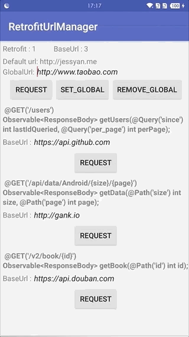

[](https://jitpack.io/#Blankyn/RetrofitUrlManager)

# RetrofitUrlManager
## Let Retrofit support multiple baseUrl and can be change the baseUrl at runtime.
## Overview


## Introduction
以最简洁的 **Api** 让 **Retrofit** 同时支持多个 **BaseUrl** 以及动态改变 **BaseUrl**.

## Download

### Step 1. Add it in your root build.gradle at the end of repositories:

```	groovy
   allprojects {
		repositories {
			...
			maven { url 'https://jitpack.io' }
		}
   }
```

### Step 2. Add the dependency

``` gradle
   dependencies {
        implementation 'com.github.Blankyn:RetrofitUrlManager:1.0.2'//请使用最新版本
        implementation 'com.squareup.okhttp3:okhttp:4.9.2'
   }
```

## Usage
### Initialize
``` java
 // 构建 OkHttpClient 时,将 OkHttpClient.Builder() 传入 with() 方法,进行初始化配置
 OkHttpClient = RetrofitUrlManager.getInstance().with(new OkHttpClient.Builder())
                .build();
```

### Step 1
``` java
 public interface ApiService {
     @Headers({"Domain-Name: douban"}) // 加上 Domain-Name header
     @GET("/v2/book/{id}")
     Observable<ResponseBody> getBook(@Path("id") int id);
}

```

### Step 2
``` java
 // 可在 App 运行时,随时切换 BaseUrl (指定了 Domain-Name header 的接口)
 RetrofitUrlManager.getInstance().putDomain("douban", "https://api.douban.com");
```

### If you want to change the global BaseUrl
```java
 // 全局 BaseUrl 的优先级低于 Domain-Name header 中单独配置的,其他未配置的接口将受全局 BaseUrl 的影响
 RetrofitUrlManager.getInstance().setGlobalDomain("your BaseUrl");

```

## 特别鸣谢

> 
> 感谢[JessYanCoding](https://github.com/JessYanCoding)项目代码
> 


## License
``` 
 Copyright 2021, blankm       
  
   Licensed under the Apache License, Version 2.0 (the "License");
   you may not use this file except in compliance with the License.
   You may obtain a copy of the License at 
 
       http://www.apache.org/licenses/LICENSE-2.0 

   Unless required by applicable law or agreed to in writing, software
   distributed under the License is distributed on an "AS IS" BASIS,
   WITHOUT WARRANTIES OR CONDITIONS OF ANY KIND, either express or implied.
   See the License for the specific language governing permissions and
   limitations under the License.
```

